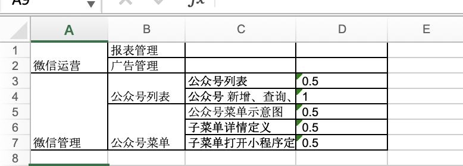

# efficient
> efficient 为了体改日常办公效率而开发的python小工具
> 目前只支持python3 对于efficient 我人并没有详细的规划只不过是用到什么写什么，所以这不是一个完备的软件包，只能称作是一些小工具的合集，一般意义上这并不是好的代码。但他一定是好用的工具，即便是没有编程经验的人，也可以对照文档，快速的使用这个工具

## outline

>outline 【大纲】是一个用来快速描述大纲，并把大纲转化成excel文档的工具

### txt 文档说明
>例如我们开始描述这样一份大纲


>1.新建一个txt文件 产品需求.txt

```txt
微信运营
    报表管理
    广告管理
微信管理
    公众号列表
        公众号列表 | 0.5 
        公众号 新增、查询、修改、删除 | 1
    公众号菜单
        公众号菜单示意图| 0.5
        子菜单详情定义 | 0.5
        子菜单打开小程序定义 | 0.5
```
>1. <kbd>enter</kbd> 表示同级
举例：使用json表示 产品需求包含<b>微信运营</b>，<b>微信管理</b>两项
```json
{
    "产品需求":[
        "微信运营",
        "公众号菜单",
    ]
}

```
>2. <kbd>|</kbd> 表示后面文字为子级，但是与父级元素为一
对一的关系。

举例：使用json 表示 <b>公众号列表 | 0.5 </b>
```json

{
    "公众号列表":0.5
}
```

>3. <kbd>enter</kbd> + <kbd>tab</kbd> 表示为后面文字为子集，但父元素包含多个子元素
举例：使用json 表示 产品需求包含<b>微信运营</b>，<b>微信管理</b>两项

```json
{
    "产品需求":[
        "微信运营",
        "公众号菜单",
    ]
}
```

>2.将大纲文件转化成excel 文件
```bash
cd <efficient_path>
python parse.py -outline ./产品需求.txt -to xls --save 产品需求.xls
```
>输出文件 产品需求.xls


>3.将大纲转化为xmind
```bash
cd <efficient_path>
python parse.py -outline ./产品需求.txt -to xmind --save 产品需求.xmind
```